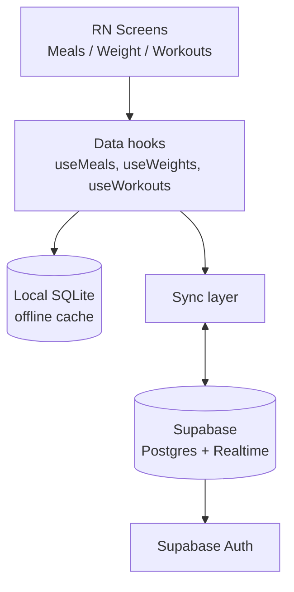

# Steady — React Native Architecture Plan

2026-09-16

Plan for rebuilding the Steady app (meals, weight, workouts tracking) as a
native React Native app, replacing the current web-based Claude artifact.

## Goals & scope

- Native iOS/Android app for the existing meals, weight, and workout tracker
- Data survives outside the Claude artifact viewer and syncs across devices
  (phone + tablet)
- Offline-capable: logging a meal or weight entry works without signal, syncs
  when back online
- Installable from the App Store / Play Store, or side-loaded for personal use
  first
- Out of scope for v1: HealthKit/Google Fit integration, notifications,
  multi-user accounts — flagged as v2 candidates

## Tech stack

| Layer | Choice | Why |
| --- | --- | --- |
| Framework | React Native + Expo (managed workflow) | Fastest path from the existing React-shaped UI; Expo handles native builds, OTA updates, and store submission tooling |
| Navigation | Expo Router (file-based, bottom tabs) | Matches the current Meals / Weight / Workouts tab layout |
| State | React hooks per tracker (Context/Zustand if it grows) | App is small — avoid Redux overhead |
| Local storage | SQLite (expo-sqlite) | Real offline-first querying/sorting, unlike key-value AsyncStorage |
| Backend / sync | Supabase (Postgres + realtime + auth) | Free tier covers one-user usage; Firebase is the alternative |
| Styling | StyleSheet + shared design tokens | Keeps the sage/clay/plum/gold palette portable; NativeWind optional later |
| Charts (v2) | Victory Native or react-native-svg-charts | For weight trend lines later |

## Architecture



Screens read and write through hooks, which always hit local SQLite first
(instant UI, works offline). A background sync layer pushes local changes to
Supabase and pulls remote changes down, reconciling by `updated_at` timestamp
on conflict.

## Data model & sync

Three tables mirroring the artifact's collections:

- `meals` (date, meal_type, time, text)
- `weights` (date, value, note)
- `workouts` (date, workout_type, duration, text)

Each row gets a UUID, `created_at`, and `updated_at`.

**Sync strategy:** offline-first, last-write-wins on `updated_at`. Writes go to
local SQLite immediately and queue for sync; a background task pushes queued
writes to Supabase on reconnect and subscribes to Supabase Realtime for changes
made on other devices. This avoids build-your-own-conflict-resolution
complexity for a single-user app.

## Project structure

```
app/
  index.tsx           redirect → Meals
  _layout.tsx         SQLiteProvider + SyncProvider + migrations
  account.tsx         Account & Sync screen (link/join email) — modal
  (tabs)/
    _layout.tsx       bottom tab navigator (⚙️ → account)
    meals.tsx
    weight.tsx
    workouts.tsx
components/
  MealRow.tsx, WeightRow.tsx, WorkoutRow.tsx
  EntryForm.tsx       shared form primitives
  ui.tsx              Card, Chip, EmptyState, DeleteButton
  SyncProvider.tsx    sync lifecycle + account state (context)
hooks/
  useMeals.ts, useWeights.ts, useWorkouts.ts
lib/
  db.ts               SQLite setup + migrations
  types.ts            row shapes
  dates.ts, uuid.ts   helpers
  supabase.ts         client config + auth
  sync.ts             push/pull + realtime engine (LWW)
  syncBus.ts          event bus decoupling hooks ↔ engine
supabase/
  schema.sql          tables + RLS + realtime (run once)
theme/
  colors.ts           sage/clay/plum/gold tokens, light + dark
  useTheme.ts
```

## Build phases

| Phase | Scope | Status |
| --- | --- | --- |
| 1. Scaffold | Expo app, tab navigation, static UI ported from the artifact | ✅ done |
| 2. Local-only | SQLite CRUD for meals/weights/workouts; fully usable offline | ✅ done |
| 3. Backend | Supabase project, anonymous auth, push/pull + realtime sync | ✅ done |
| 4. Polish | Weight trend chart, delta indicators, empty states, dark mode | 🔶 partial (deltas, empty states, dark mode done) |
| 5. Ship | EAS Build, TestFlight/internal track, then store submission | ⬜ |

### Phase 3 — how sync works

- **Config:** `EXPO_PUBLIC_SUPABASE_URL` + `EXPO_PUBLIC_SUPABASE_ANON_KEY`
  (see `.env.example`). Unset → the app runs exactly as Phase 2, local-only.
- **Schema:** run `supabase/schema.sql` once against a new Supabase project.
  It creates the three tables, owner-only row-level security, and adds them to
  the realtime publication.
- **Auth (anonymous → link email):** the app signs in anonymously by default,
  so day one has no sign-in wall while still backing up the device. To sync a
  phone + tablet, the Account screen (`app/account.tsx`) links an email to the
  anonymous account — `updateUser({ email })` keeps the same user id, so no
  data migrates — and the other device joins by signing in with that email
  (6-digit code). When a device joins a different account, `SyncProvider`
  detects the user-id change and calls `SyncEngine.resetForNewUser()` to
  re-pull the shared history and re-push this device's local rows.
- **Engine (`lib/sync.ts`):** last-write-wins on `updated_at`.
  - *push* — rows flagged `pending_sync = 1` are upserted, then cleared.
  - *pull* — rows changed since a per-table cursor are fetched and applied if
    they win LWW.
  - *realtime* — a Postgres-changes subscription applies other devices' writes
    live.
  - Deletes are tombstones (`deleted_at`) so they propagate like any edit.
- **Triggers (`components/SyncProvider.tsx`):** initial sync on launch, a
  debounced push after each local write, and a full sync on reconnect
  (NetInfo) and on app foreground (AppState). Hooks and the engine stay
  decoupled through a small event bus (`lib/syncBus.ts`).

Known v1 limitation: the pull cursor advances with `updated_at > cursor`, so
rows sharing an identical millisecond timestamp at a page boundary could be
skipped until their next change — negligible for single-user volumes, worth
revisiting if data grows.

## Cost & store

- Expo/EAS Build: free tier covers occasional personal builds
- Supabase: free tier (500MB DB, 50k MAU) far exceeds a single-user tracker
- Apple Developer Program: $99/year, only if publishing to the App Store
- Google Play: $25 one-time, only if publishing to Play Store
- Side-loading (TestFlight / Android APK) avoids both store fees for personal use

## Open questions

- [ ] Personal use only, or App Store distribution eventually?
- [x] Single device, or sync across your own phone + tablet? → **Cross-device**,
  via anonymous → link-email accounts (see Auth above).
- [x] Keep Supabase, or prefer Firebase? → **Supabase** (already the backend).
